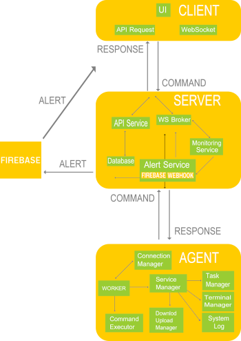
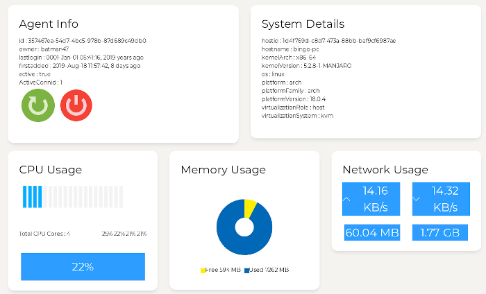
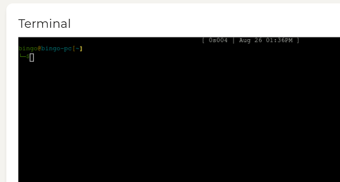
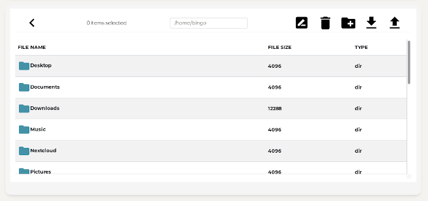
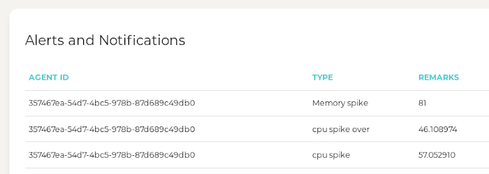
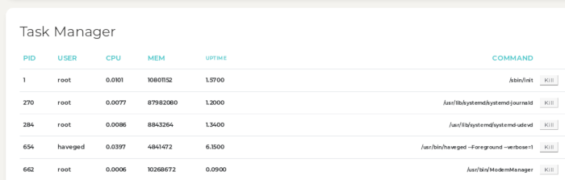
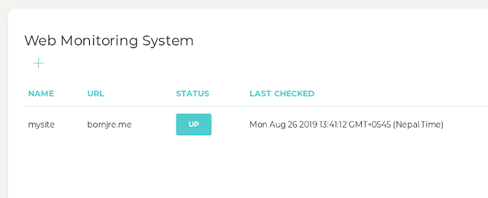

# [Tricloud Monitoring System Server](https://github.com/indrenicloud/tricloud-client-server)

   

Tricloud is a monitoring system over websocket which has three components. A agent [github.com/indrenicloud/tricloud-agent](https://github.com/indrenicloud/tricloud-client-react) running on target system, browser [github.com/indrenicloud/tricloud-client-react](https://github.com/indrenicloud/tricloud-client-react) that show information and control and server [github.com/indrenicloud/tricloud-server](https://github.com/indrenicloud/tricloud-server) that acts as broker between agents and browser.

## Table of Contents

* [Architecture](#arch)
* [Features](#features)
* [Documentation](#documentation)
* [Licensing](#licensing)

## 
Server and agents are written in [Golang](https://golang.com) and client is written in [React](https://reactjs.org/).
 Websocket message header between browser, broker and agents is fixed 4byte. It is used for multiplexing between differents clients as well as different type of messages and broker can multiplex message without actually decoding body. Message body is corrently encoded with JSON (except for downloading or uploading files which is just raw binary) but is planned change to more efficient binary encoding oneof(msgpack, protobuffer, flatbuffer). 

## Features

* [System Information](#system-information)
* [Terminal](#terminal)
* [FileManager](#filemanager)
* [Alert and Messaging](#alert-and-messaging)
* [Task Manager](#task-manager)
* [Web Monitor](#web-monitor)

### System Information

### Terminal

### FileManager

### Alert and Messaging
Notifictions is pushed through firebase and webhook (like discord channel webhook ), also a unified list all the alerts in the browser.

### Task Manager

### Web Monitor

## Documentation
TODO

## Licensing

- Licensed under [MIT](https://github.com/indrenicloud/tricloud-client-server/blob/master/LICENSE.md)

